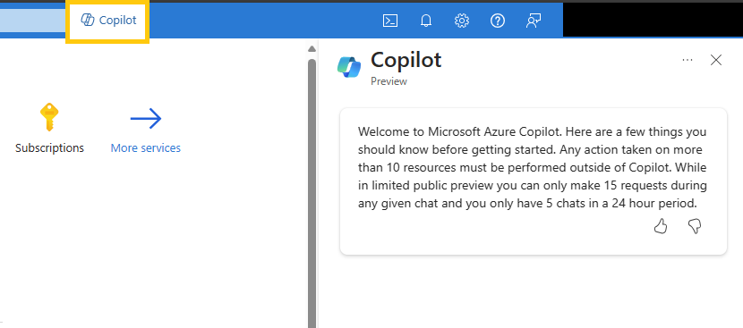

# Use Azure CLI with Microsoft Copilot

## Microsoft Copilot 

[Microsoft Copilot for Azure](https://techcommunity.microsoft.com/t5/azure-infrastructure-blog/simplify-it-management-with-microsoft-copilot-for-azure-save/ba-p/3981106) is an AI companion that helps you design, operate, optimize, and troubleshoot your cloud infrastructure and services. Its goal is to address the issues that CLI usage knowledge in regards to end-to-end scenarios are difficult to find, and related questions cannot always receive timely and professional support.

Currently, users must [apply for access](https://azure.microsoft.com/products/copilot#Usecases) in order to use Microsoft Copilot.

The benefits of using Microsoft Copilot for Azure CLI is as follows:
- **Design**: Users can create and configure the services needed and align with organizational policies.
- **Operate**: Users can answer questions, author complex commands, and manage resources.
- **Troubleshoot**: Users can orchestrate across Azure services for insights to summarize issues, identify causes, and suggest solutions.
- **Optimize**: There are improved costs, scalability, and reliability through recommendations for the user's environment.

### How to use Azure CLI successfully with Microsoft Copilot

To use this AI tool, go to the Azure Portal and select the **Copilot** icon on the top taskbar. The copilot window will open with a chat assistant where you can ask it a question:



When you tell Microsoft Copilot for Azure about a task you want to perform with Azure CLI, it provides a script with the necessary commands. You'll see which placeholder values (marked in blue font) that you need to update with the actual values based on your environment. 

## Use a reference command

For this specific example, use Microsoft Copilot to assist with using the reference command `az group`:


Make sure to replace the variables (marked in blue) with actual values, or define the variables in your variable block before running the command:

# [Replace Variables](#tab/define)
```azurecli-interactive
# Create a resource group
az group create --name myResourceGroup --location eastus
```

# [Variable Block](#tab/variableblock)
```azurecli-interactive
# Variable block
let "randomIdentifier=$RANDOM*$RANDOM"
resourceGroup="myResourceGroup"
locationName="eastus"

# Create a resource group
az group create --name resourceGroup --location $location
```
***

## Look up an Azure CLI script

Suppose you encounter an Azure CLI script that includes references and parameters that you are not knowledgeable of. Use Microsoft Copilot to look up the command by entering the command as if you were in the terminal: 


Microsoft Copilot references and links other Microsoft Learn documents related to your specific CLI topic and automatically generates follow-up questions as well. 

## Use an Azure service

Use Azure CLI with Microsoft Copilot to create an end-to-end scenario where you create an Azure SQL database:


Follow the steps provided by first creating an Azure SQL server:

```azurecli-interactive
az sql server create --name $serverName --resource-group $resourceGroup --location $location --admin-user $adminUser --admin-password $adminPassword
```

Replace the variables with actual values (or define the values in a variable block):

```azurecli-interactive
az sql server create --name myServer --resource-group myResourceGroup --location eastus --admin-user myAdminUser --admin-password myAdminPassword
```

Next, create your Azure SQL database:

```azurecli-interactive
 az sql db create --name $databaseName --resource-group $resourceGroup --server $serverName --service-objective $serviceObjective
```

Replace the variables with actual values (or define the values in a variable block):

```azurecli-interactive
 az sql db create --name myDatabaseName --resource-group myResourceGroup --server myServerName --service-objective myServiceObjective
```

## See also

* [Apply for Microsoft Copilot for Azure](https://azure.microsoft.com/en-us/products/copilot#Usecases)
