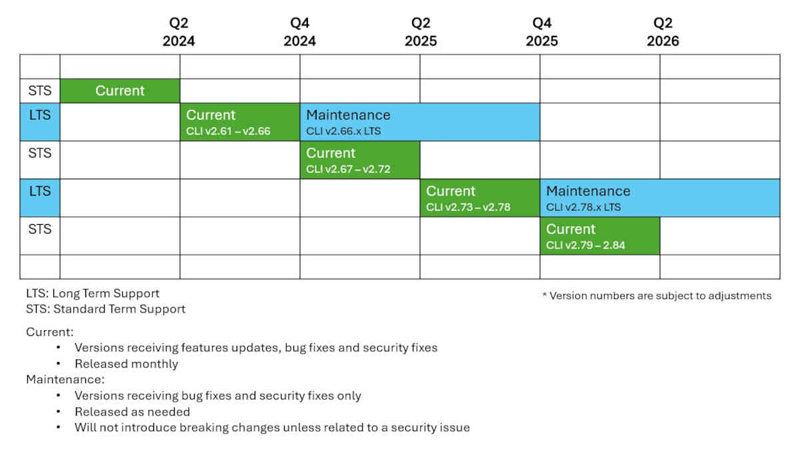

# Azure CLI support lifecycle

Every Microsoft product has a lifecycle. The lifecycle begins when a product is released and ends when it's no longer supported. Knowing key dates in this lifecycle helps you make informed decisions about when to upgrade or make other changes to your software.

The Azure CLI support lifecycle is designed to provide clarity and predictability for customers regarding support for each release. The length of time and degree of support vary based on a few qualifications. The Azure CLI support lifecycle follows Microsoft's [Modern lifecycle policy](/lifecycle/policies/modern) unless specified otherwise in this article.

## Reference types

There are two Azure CLI reference types.

* **Core:** Azure CLI references that are published as a permanent part of the CLI are called "core" references. All core references install with the Azure CLI and you can't choose a subset of references. If you run the CLI through Azure Cloud Shell, core references are always up to date.

* **Extensions:** Extensions aren't shipped as part of the CLI but run as CLI commands. Some extensions are a permanent part of the Azure CLI, but often, an extension gives you access to more capabilities and preview features.

A single reference group can have both core and extension commands. For example, in the [az vm](/cli/azure/vm) reference group, [az vm nic add](/cli/azure/vm/nic) is a core reference command while [az vm repair create](/cli/azure/vm/repair) is an extension.

To learn more about Azure CLI extensions, see [Use and manage Azure CLI extensions](/cli/azure/azure-cli-extensions-overview).

## Versioning

### Core

Azure CLI core version is composed of three numbers: `major.minor.patch`.

* **Major versions:** Major changes, including architectural and fundamental design changes. We provide critical security fixes to the last minor version of the previous major version for three years.
* **Minor versions:** Updated for feature updates and improved Azure service coverage.
* **Patch versions:** Backward compatible fixes without new features or functionality changes.

### Extensions

Azure CLI extensions follows [Semantic Versioning](https://semver.org/) for version numbering. Semantic versioning is a system that uses a three-part number format: `major.minor.patch`.

* **Major versions:** Breaking changes, often due to an incompatible API change.
* **Minor versions:** Backward compatible feature updates, or added functionality.
* **Patch versions:** Backward compatible fixes without new features or functionality changes.

## Release cadence

The Azure CLI release cadence is designed to provide customers with predictable release dates, empowering businesses, developers, and the community to make strategic decisions when planning their roadmaps.

Azure CLI **Core** is updated monthly with a maximum of two releases introducing breaking changes. Breaking change releases occur during the second and fourth quarters of each year.

Azure CLI **extensions** don't have a specific release cadence and need to be upgraded manually.

Breaking changes might not affect existing scripts, but it's a good practice to verify your scripts in a test environment before performing an upgrade.

> [!NOTE]
> The release cadence might be slightly adjusted to be aligned with major announcements relevant to Azure.

## Standard Term Support releases (STS)

The STS versions of Azure CLI core give you the most recent capabilities. STS releases don't experience breaking changes for six months. Breaking changes are released in the second and fourth quarters of the calendar year, and usually align with Microsoft Build and Microsoft Ignite.

STS releases have the following characteristics:

* STS releases are released monthly and receive feature updates, bug fixes, and security fixes.
* For a STS version to be supported, you need to be on the latest minor version of the STS release.
* STS releases don't have a specific marker when running the `az version` command. This ensures backward compatibility with tools or scripts that might utilize the information.
  
## Long Term Support releases (LTS)

The LTS versions of Azure CLI Core give you a "maintenance" period of 12 months following the "current" period. During this time, the LTS release doesn't experience breaking changes _unless required by a security fix_.

The LTS versions are based on Azure CLI releases that introduce major changes during the second quarter of the calendar year. This usually aligns with Microsoft Build.

LTS releases have the following characteristics:

* During the first six months, the LTS releases are released monthly and receive feature updates, bug fixes and security fixes.
* During the following 12 months, the LTS releases are released when necessary and only receive bug fixes and security fixes.
* For a LTS version to be supported, you need to be on the latest version of the LTS release.

Easily find the LTS release date by running the `az version` command. Notice the `azure-cli-support` line that indicates the LTS date.

```output
{  
  "azure-cli": "2.48.0",  
  "azure-cli-core": "2.48.0",  
  "azure-cli-support": "LTS-20240521",  
  "azure-cli-telemetry": "1.0.8",  
  "extensions": {  
  }  
}  
```

The following image illustrates the release cadence and support lifecycle of Azure CLI for STS and LTS releases.



The following table provides examples of how the release cadence correlates with the support
lifecycle:

> [!NOTE]
> The dates in the following table are for example purposes only. The actual release dates vary.

| Version number | Release schedule | Breaking changes | Release type | Support type | Supported until version | LTS version |
| -------------- | ---------------- | ---------------- | ------------ | ------------ | ----------------------- | ----------- |
| 2.61.0         | May 2024         | Yes              | Major        | STS          | 2.62.0                  | |
| 2.62.0         | June 2024        |                  | Minor        | STS          | 2.63.0                  | |
| 2.63.0         | July 2024        |                  | Minor        | STS          | 2.64.0                  | |
| 2.64.0         | August 2024      |                  | Minor        | STS          | 2.65.0                  | |
| 2.65.0         | September 2024   |                  | Minor        | STS          | 2.66.0                  | |
| 2.66.0         | October 2024     |                  | Minor        | **LTS**      | _**2.79.0**_            | 2.66.0 |
| 2.67.0         | November 2024    | Yes              | Major        | STS          | 2.68.0                  | 2.66.x |
| 2.68.0         | December 2024    |                  | Minor        | STS          | 2.69.0                  | 2.66.x |
| 2.69.0         | January 2025     |                  | Minor        | STS          | 2.70.0                  | 2.66.x |
| 2.70.0         | February 2025    |                  | Minor        | STS          | 2.71.0                  | 2.66.x |
| 2.71.0         | March 2025       |                  | Minor        | STS          | 2.72.0                  | 2.66.x |
| 2.72.0         | April 2025       |                  | Minor        | STS          | 2.73.0                  | 2.66.x |
| 2.73.0         | May 2025         | Yes              | Major        | STS          | 2.74.0                  | 2.66.x |
| 2.74.0         | June 2025        |                  | Minor        | STS          | 2.75.0                  | 2.66.x |
| 2.75.0         | July 2025        |                  | Minor        | STS          | 2.76.0                  | 2.66.x |
| 2.76.0         | August 2025      |                  | Minor        | STS          | 2.77.0                  | 2.66.x |
| 2.77.0         | September 2025   |                  | Minor        | STS          | 2.78.0                  | 2.66.x |
| 2.78.0         | October 2025     |                  | Minor        | STS          | 2.79.0                  | 2.66.x |
| 2.79.0         | November 2025    | Yes              | Major        | **LTS**      | _**2.91.0**_            | 2.79.0 | 
| 2.80.0         | December 2025    | Yes              | Minor        | STS          | 2.81.0                  | 2.79.x | 

**Examples:**

* To qualify for support, you must update to 2.63.0 when released if you have Azure CLI 2.62.0 installed.
* If Azure CLI 2.66.0 is the last release of Azure CLI before breaking change in the fourth quarter of the calendar year, it's supported until the release of Azure CLI 2.79.0.

## Breaking changes

Major version releases of Azure CLI introduce breaking changes and occur up to two times per year. Breaking changes can occur at any point for preview extensions. Non-GA extensions aren't required to adhere to breaking change policies.

For detailed information about breaking changes in Azure CLI, see [Release notes](./release-notes-azure-cli.md).

## Supported environments

The Azure CLI runs on multiple operating systems (OS) and architectures. For a complete list, see [Install the Azure CLI](./install-azure-cli.md). To be supported by Microsoft, the following criteria must be met:

* The version of Azure CLI is supported.
* The version of the OS is currently in mainstream support by the OS publisher.
* The dependencies required by the current version of Azure CLI are supported on the OS.

The Azure CLI ends support for a platform when one of the following conditions is met:

* The OS reaches its end of life as defined by the platform owner.
* The version of Python required by Azure CLI reaches its end of life, is no longer supported on the OS, or has an unfixed critical security issue.

Azure CLI announces the end of support of an OS or one of its dependencies within three months of the public announcement of the retirement.

## Python dependency

Azure CLI depends on Python version 3.8 or above. The following table summarizes the expected end of support for each version of Python:

|Python version|End of support date|
|-|-|
|3.8|October 2024 |
|3.9|October 2025 |
|3.10|October 2026 |
|3.11|October 2027 |

Azure CLI can only be supported on operating systems where the above versions of Python are supported.

* **Windows:** The currently supported versions of Windows client and server meet Python version requirements.
* **macOS:** The currently supported version of macOS 12 and above meet Python version requirements.
* **Linux:**
  * Each supported operating system has a lifecycle defined by its sponsor organization.
  * Support is typically removed when an operating system goes out of mainline support, at which time we stop testing and supporting it.
  * Here are the supported Linux operating systems for the Azure CLI:

    |Operating system|Version|End of support|
    |-|-|-|
    | Ubuntu | 20.04 LTS | April 2025 |
    | | 22.04 LTS | April 2027 |
    | | 24.04 LTS | June 2029 |
    | Debian | 11 | |
    | | 12 | |
    | Alpine | 3.17 | November 22, 2024 |
    | RHEL | 8 | May 31, 2029 |
    | | 9 | May 31, 2032 |
    | CentOS Stream | 9 | Estimated 2027 |
    | Mariner | 2.0 | |

    > [!NOTE]
    > On RHEL 7, only Azure CLI 2.38 is supported. Microsoft is no longer providing updates or bug fixes for this distribution.

## See also

* [Azure CLI terminology](./reference-types-and-status.md)
