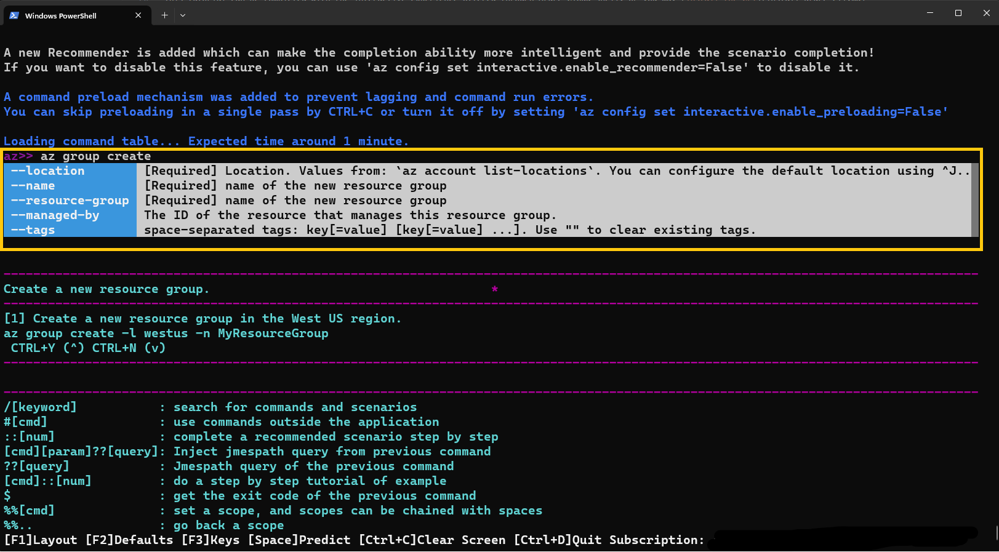

# Overview and Prerequisites

In this tutorial, you learn how to create a virtual network (VNet) and deploy a virtual machine (VM) to the VNet with the Azure CLI. This tutorial
also covers Azure CLI specific concepts such as shell variables and output queries.

This tutorial can be completed with the interactive experience offered through Azure Cloud Shell, or you may [install the CLI](install-azure-cli.md)
locally.

Use __ctrl-shift-v__ (__cmd-shift-v__ on macOS) to paste tutorial text into Azure Cloud Shell.

[!INCLUDE [include](~/articles/reusable-content/azure-cli/azure-cli-prepare-your-environment.md)]

## Shell variables

Shell variables store values for future use and can be used to pass values to command parameters. Shell variables allow for the reuse of commands, both on their own and in scripts. This tutorial uses shell variables for easier customization of command parameters. To use your own parameter values instead of using the provided values, change the values assigned to the shell variables. For more information about shell variables, see [Use shell variables](./azure-cli-variables.md#use-shell-variables).

## Create a resource group

In Azure, all resources are allocated in a resource management group. Resource groups provide logical groupings of resources
that make them easier to work with as a collection. Use the [az group create](/cli/azure/group#az_group_create) command to create a resource group named `VMTutorialResources`.

# [Bash](#tab/bash)

```azurecli
# create Bash shell variables
resourceGroup=VMTutorialResources
location=eastus

az group create --name $resourceGroup --location $location
```

# [PowerShell](#tab/powershell)

```azurecli
# Create PowerShell variables
$resourceGroup = "VMTutorialResources"
$location = "eastus"

az group create --name $resourceGroup --location $location
```

***

## Create a resource group in interactive mode

Interactive mode offers new AI functionalities that allow the user to run and search for commands more efficiently. To get a better understanding of required parameters and steps related to `az group create`, try out Azure CLI in interactive mode by running the `az interactive` command. Please note that all commands throughout this tutorial can be run in interactive mode.

```azurecli
# install interactive mode
az interactive
```

In the following example, the command recommendation feature in interactive mode lists and defines all of the required parameters needed for `az group create`:

```azurecli
# get options for az group create
az>> az group create
```


