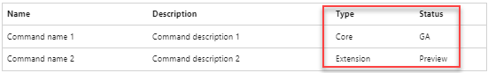

# Welcome to the Azure CLI

We are glad you are here! You have chosen a tool that will allow you to create, update, and delete Azure resources from a command-line. In this tutorial, you will onboard with the Azure CLI and learn how to complete the following tasks:

> [!div class="checklist"]
>
> * Get to know the Azure CLI is this tutorial step
> * [Prepare your environment](./get-started-tutorial-1-prepare-environment.md)
> * [Write commands for Bash, Powershell and Cmd environments](./get-started-tutorial-2-work-environments.md)
> * [Use variables to store values for a script](./get-started-tutorial-3-use-variables.md)

## What is the Azure CLI?

The Azure Command-Line Interface (CLI) is a cross-platform command-line tool to connect to Azure and execute administrative commands on Azure resources. It allows the execution of commands through a terminal using interactive command-line prompts or a script.

For interactive use, you first launch a shell such as cmd.exe on Windows, or Bash on Linux or macOS, and then issue a command at the shell prompt. To automate repetitive tasks, you assemble the CLI commands into a shell script using the script syntax of your chosen shell, and then you execute the script.

You can install the Azure CLI locally on Linux, macOS, or Windows computers. Azure CLI can also be used from a browser through Azure Cloud Shell or run from inside a Docker container.

## What shell environment should I use?

Windows PowerShell, PowerShell, Cmd, and Bash are shell environments. Your shell environment not only determines which tools you can use but also changes your command-line experience. For example, there are important quoting differences between shells. An Azure CLI parameter value that contains a quote cannot always be copied successfully between shells.

| Shell Environment | Azure CLI | Azure PowerShell | Quoting example | Variable example
|-|-|-|-|-|
|[Cmd](/windows-server/administration/windows-commands/cmd) | Yes | | \`50`|set variableName=variableValue
|[Bash](https://opensource.com/resources/what-bash)| Yes | | \\\`50\\`| variableName=variableValue
|[Windows PowerShell](/powershell/scripting/windows-powershell/overview) | Yes |Yes| \`\`50\`\`| $variableName=variableValue
|[PowerShell](/powershell/scripting/overview) | Yes | Yes| \`\`50\`\`| $variableName=variableValue

[Azure Cloud Shell](/azure/cloud-shell/get-started) is a hosted shell environment that runs on an Ubuntu container. Cloud Shell provides two shell environments: Bash (with Azure CLI preinstalled) and PowerShell (with Azure PowerShell preinstalled).

Both the Azure CLI and Azure PowerShell also run inside a [Docker container](./run-azure-cli-docker.md).

## How does the Azure CLI compare to Azure PowerShell?

Azure CLI and [Azure PowerShell](/powershell/azure/) are both command-line tools that enable you to create and manage Azure resources, but they are distinctly different.

| Compare | Azure CLI | Azure PowerShell |
|-|-|-|
|What is it?|Cross-platform **command-line interface** | Cross-platform **PowerShell module**
|Built on | Python | PowerShell
|Install on| Windows, macOS, Linux | Windows PowerShell, PowerShell
|Run in|Windows PowerShell, Cmd, Bash, Azure CLoud Shell, Docker container, and other Unix shells.| Windows PowerShell, PowerShell, Azure Cloud Shell, Docker container
|Terms| Reference groups, reference subgroups and reference commands | Modules, cmdlets and aliases
|Syntax example | [az storage account create](/cli/azure/storage/account#az-storage-account-create) | [New-AzStorageAccount](/powershell/module/az.storage/new-azstorageaccount) |
|Learn more | [What is Azure CLI?](./what-is-azure-cli.md) | [What is Azure PowerShell?](/powershell/azure/what-is-azure-powershell)

## What are the Azure CLI command components?

All Azure CLI reference commands are one of two reference types:

* **Core** components of the Azure are part of the primary Azure CLI service and ship from Microsoft on a [release schedule](./release-notes-azure-cli.md).
* **[Extensions](./azure-cli-extensions-overview.md)** are not shipped as part of the core Azure CLI but they run as CLI commands. With extensions, you gain access to experimental and prerelease commands along with the ability to write your own CLI interfaces.

An Azure CLI syntax has four parts. For example, this is how [az storage account local-user create](/cli/azure/storage/account/local-user#az-storage-account-local-user-create) breaks down into syntax parts:

| Term | Example |
|-|-|
| Reference _group_ | az `storage`
| Space-delimited reference _subgroups_ | `account` `local-user`
| Reference _command_ | az storage account local-user `create`
| Reference command _parameters_ | `name`, `--account-name`, `--resource-group`

## What are Azure CLI status options?

Every Azure CLI reference group, subgroup, command and parameter has one of three statuses. The status determines the support level.

* Experimental
* Preview
* GA (General acceptance)

Find the reference type and status of a command in [reference documentation](/cli/azure/reference-index).

## Get more detail

Do you want more detail on one of the topics covered in this tutorial step? Use the links in this table to learn more.

|Topic| Learn more|
|-|-|
| Environments | [Choose the right Azure command-line tool](./choose-the-right-azure-command-line-tool.md)
| Terms | [Azure CLI terms and status](reference-types-and-status.md) |
| Extensions | [Use and manage extensions with the Azure CLI](./azure-cli-extensions-overview.md)
| Lifecycle | [Azure CLI support lifecycle]()

## Next Step

Now that you've learned about the Azure CLI, proceed to the next step to prepare your environment and execute your first Azure CLI reference command.

> [!div class="nextstepaction"]
> [Prepare your environment](./get-started-tutorial-1-prepare-environment.md)
