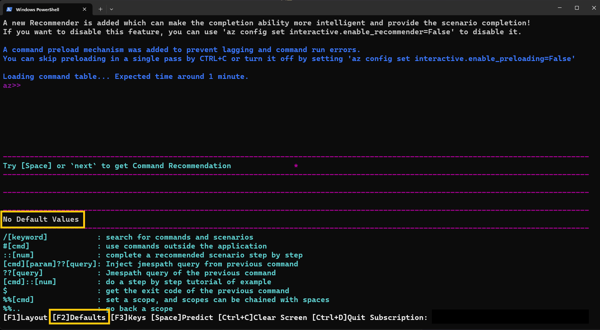
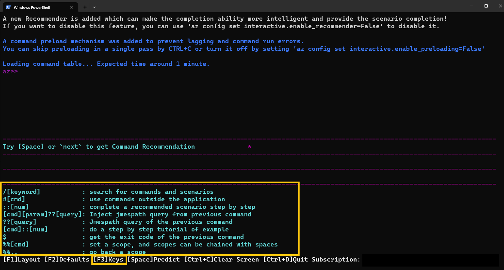
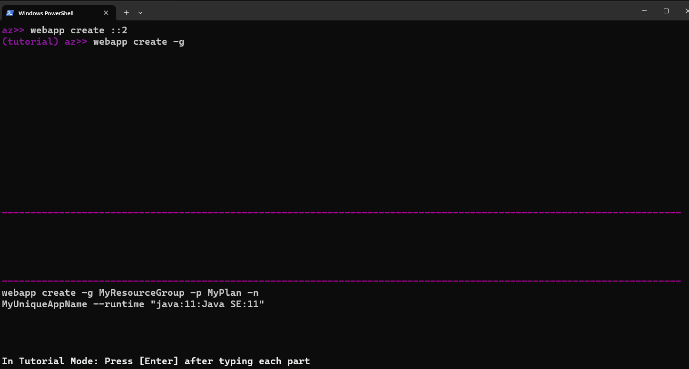
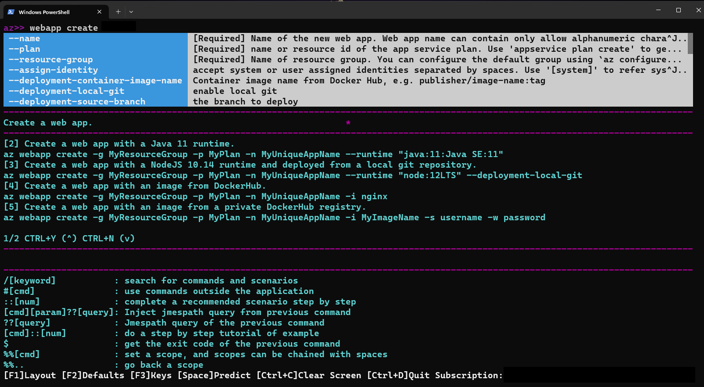
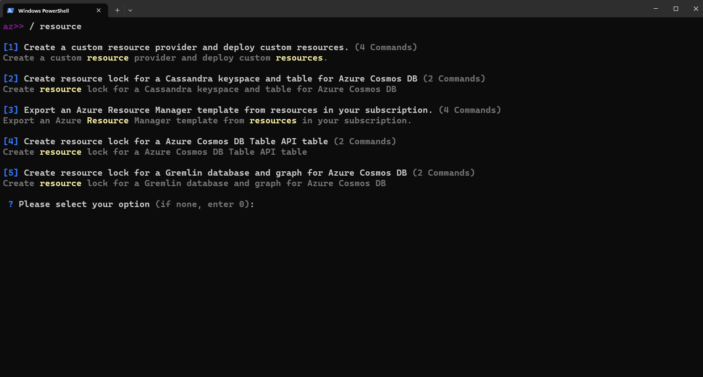

# Azure CLI interactive mode

## What is the Azure CLI interactive mode?

Azure CLI Interactive Mode (az interactive) provides users an interactive environment to run Azure CLI commands. The interactive mode makes it easier for you to learn the Azure CLI’s capabilities, command syntax, and output formats. It provides autocompletion dropdowns, auto-cached suggestions combined with runtime documentation, and includes examples about how each command is used. Azure CLI Interactive Mode aims to provide an ideal experience for users learning to use Azure CLI commands. 

## Prerequisites

Use a Bash or PowerShell environment in [Azure Cloud Shell](/azure/cloud-shell/quickstart) or [run the Azure CLI locally](./install-azure-cli-windows.md?tabs=powershell) in PowerShell 7.

[:::image type="icon" source="./media/hdi-launch-cloud-shell.png" alt-text="Launch Azure Cloud Shell" :::](https://shell.azure.com). 

## Run Azure CLI interactive mode 

Use Azure CLI in interactive mode by running the following command:

```azurecli-interactive
az interactive
```

The Azure CLI interactive mode places you in an interactive shell with autocompletion, command descriptions, and examples.


## Configure your options in interactive mode 

Interactive mode optionally displays command descriptions, parameter descriptions, and command examples.

Turn descriptions and examples on or off using <kbd> F1</kbd> .


You can turn the display of parameter defaults on or off using <kbd>F2</kbd> .



You can toggle the display of some key gestures by using <kbd> F3</kbd> .



## Scope

In interactive mode, you can edit the scope to a specific command group to have all commands interpreted in that scope. 
This method provides an efficient way of inputting your commands, demonstrated in the following examples using the command group  `vm`. 

Instead of typing these commands:

```azurecli-interactive
az>> vm create -n <myVirtualMachine> -g <myResourceGroup> --image Ubuntu2204
az>> vm list -o table
```

You can scope to the vm command group and type these commands:

```azurecli-interactive
az>> %%vm
az vm>> create -n <myVirtualMachine> -g <myResourceGroup> --image Ubuntu2204
az vm>>list -o table
```

You can edit the scope to lower-level command groups as well like `vm image` by using `%%vm image`.
In this case, since we're already scoped to `vm`, we would use `%%image`.

```azurecli-interactive
az vm>> %%image
az vm image>>
```

At that point, we can edit the scope back up to `vm` using `%%..`,
or we can edit the scope to the root with just `%%`.

```azurecli-interactive
az vm image>> %%
az>>
```

## Query in interactive mode 

You can execute a JMESPath query on the results of the last command that you executed by using `??`followed by a JMESPath query.
For example, after you created a group, you can retrieve the `id` of the new group.

```azurecli-interactive
az>> group create -n <myResourceGroup> -l westEurope
az>> "?? id"
```

You can also use this syntax to use the result of the previous command as an argument for your next command.*
For instance, after having listed all groups, you can query for more specific results by using the list you just generated. 

```azurecli-interactive
az>> vm create --name <myVirtualMachine> --resource-group <myResourceGroup> --image Ubuntu2204 --no-wait -o json
az>> group list -o json

# List all the resources of type `virtualMachine`on the first group whose location is westeurope. 
az>> resource list -g "?? [?location=='westeurope'].name | [0]" --query "[?type=='Microsoft.Compute/virtualMachines'].name
```

To learn more about querying the results of your commands, see [Query command results with the Azure CLI](use-azure-cli-successfully-query.md).

## Run Bash and PowerShell commands in interactive mode  

You can run both Bash and PowerShell commands without leaving interactive mode.

For Bash scripts, use the `#[cmd]` syntax:

```bash
az>> #dir
```

For PowerShell scripts, use the regular PowerShell syntax:

```powershell
az>> $PSVersionTable
```

## View examples of your commands in interactive mode 

You can scroll to the next page of examples using <kbd> CTRL</kbd> +<kbd> N </kbd> and the previous page using <kbd> CTRL </kbd>  +<kbd> Y</kbd> .


You can also look at a specific example using `::#`.

```azurecli
az>> webapp create ::2
```



## Artificial intelligence (AI) functionalities

The Azure CLI team has combined AI with Azure CLI interactive mode to provide users with a more beginner-friendly interactive experience. These AI functionalities allow users to learn about how to utilize Azure CLI interactive mode with more ease and efficiency. 

The new AI features consist of:

- **Intelligent completion**: The AI-powered recommendation system uses telemetry analysis in order to predict and analyze customer behavior. These results lead to the prioritization of the most used and needed content options.
- **Command recommendation**: The AI offers subsequent commands based on the most used commands in other similar sessions.
- **Scenario identification**: The AI identifies the current possible scenarios and recommends a set of related command combinations for your specific end to end scenario.
- **Usable knowledge search**: The AI allows you to input natural language in order to search for commands for specific usage scenarios. 

### How to use AI functionalities with Azure CLI interactive mode 

When using interactive mode within Azure CLI, upgrade to the latest version to use the new features.

```azurecli-interactive
az extension add --name interactive --upgrade
```

To use **command recommendation**, run a command and click <kbd>space</kbd> or <kbd>next</kbd>. 



To use **scenario recommendation**, make sure you run a command first. Then after the command runs successfully, enter a <kbd>space</kbd>. Various command sets are listed, and you will see that whichever command set you select, a `::[num]` is added after the <kbd>space</kbd> you entered.

>[!NOTE]
> For scenario identification, if you enter `::[num]` with no space before it, then it will return an error. Make sure to enter a single <kbd>space</kbd> in order to be able to view the list of command sets. 


To use **usable knowledge search**, run `/ [keyword]` to search for commands and scenarios.




To disable the new AI features for Azure CLI interactive mode input the following command:

```azurecli-interactive
az config set interactive.enable_recommender=False
```
