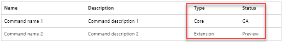

# Azure CLI release highlights

This page highlights new features and upcoming changes for the Azure CLI.

## Docker container image

Beginning with Azure CLI version 2.67.0, to be released on November 19, 2024, the default Docker container image for Azure CLI will be based on Azure Linux. To avoid any disruptions, review and update any dependencies you may have on the default Docker container image for Azure CLI.

For more information see [How to run the Azure CLI in a Docker container](./run-azure-cli-docker.md).

## Select your subscription at time of login

We've listened to your feedback and improved the Azure CLI interactive login experience to include a subscription selector. To use the new feature, see [Sign in interactively with Azure CLI ](./authenticate-azure-cli-interactively.md#interactive-login).

## Protect sensitive information

Beginning in [Azure CLI 2.57](./release-notes-azure-cli.md#february-06-2024), a warning message can be displayed when reference commands result in the output of sensitive information. For more information, see [Manage Azure secrets using the Azure CLI](./azure-cli-manage-secrets.md).

## Azure Copilot for Azure CLI

[Microsoft Copilot for Azure](https://aka.ms/MicrosoftCopilotforAzureDocs) (preview) is published! Copilot is an AI-powered tool to help you do more with Azure. It unifies knowledge and data across hundreds of Azure services to increase productivity, reduce costs, and provide deep insights. Microsoft Copilot for Azure (preview) helps you learn about Azure by answering questions, and it provides information tailored to your own Azure resources and environment. By letting you express your goals in natural language, Copilot simplifies your Azure management experience. This benefits Azure CLI users because the knowledge of Azure CLI is built into Copilot!

Access Microsoft Copilot for Azure (preview) in the Azure portal, and tell Copilot what you would like to do using Azure CLI. For example:

- I want to create a virtual machine using Azure CLI.
- I want to update service principal credentials using Azure CLI.
- I want to create a web app using Azure CLI.

To enable access to Microsoft Copilot for Azure (preview) for your organization, [complete the registration form](https://aka.ms/MSCopilotforAzurePreviewRequest). The application process only needs to be completed once per tenant. Check with your administrator if you have questions about joining the preview.

## Reduced Docker image size

With the release of Azure CLI version 2.54.0, the size of the Docker image of `azure-cli` is reduced from 1.1 GB to 700 MB! This reduction is a 36.3% decrease resulting in improved download speed and faster startup. For more information, see "Trim Azure CLI’s docker image size" in [Azure Command-line Tools Ignite 2023 Announcement](https://techcommunity.microsoft.com/t5/azure-tools-blog/azure-command-line-tools-ignite-2023-announcement/ba-p/3984502).

## 64-bit Windows install

You can now [install the Azure CLI on Windows](install-azure-cli-windows.md) with a 64-bit MSI. The 32-bit MSI, PowerShell command, and Windows Package Manager are still available, but the 64-bit MSI is new! Anytime you install the Azure CLI, previously installed versions are updated automatically. This behavior allows you to try out the 64-bit install but reinstall the 32-bit MSI if you choose.

## ZIP file Windows install

Beginning in [Azure CLI 2.57.0](./release-notes-azure-cli.md#february-06-2024), the Azure CLI can be installed using a ZIP file in Windows environments. See the ZIP tab in [Install Azure CLI on Windows](./install-azure-cli-windows.md?tabs=zip#install-or-update) for more information.

## Tab completion in PowerShell

If you run the Azure CLI in PowerShell, tab completion is now available! Follow the instructions in [enable tab completion on PowerShell](/cli/azure/install-azure-cli-windows#enable-tab-completion-on-powershell). The parameter values needed for PowerShell's `Register-ArgumentCompleter` command are provided in the article.

Tab completion is also available in [Azure Cloud Shell](/azure/cloud-shell/quickstart?toc=%2Fcli%2Fazure%2Ftoc.json&bc=%2Fcli%2Fazure%2Fbreadcrumb%2Ftoc.json&tabs=azurecli) and in most Linux distributions.

## Sign in with Web Account Manager (WAM)

The Azure CLI now offers preview support for sign in with Web Account Manager (WAM). Read about the benefits of WAM and how to enable the feature in [Sign in with Web Account Manager](/cli/azure/authenticate-azure-cli#sign-in-with-web-account-manager-wam).

## Reference type and status

Reference type and status information is now available in Azure CLI reference content. Why is this important? Reference command status determines the support level.

You see this information in three places:

- **New "type" and "status" columns in reference list tables.**
  
  

  For a live example, see the [reference index](/cli/azure/reference-index) or drill down to [az account](/cli/azure/account).

- **New status indicators under command names.**

  

  If there's no status indicator, the command group or reference command is GA (Generally Available). For a live example, see [az account subscription](/cli/azure/account/subscription).

- **New status indicator for parameters.** Only deprecated parameters show a status. All other parameters inherit the status of the reference command.

For more information on Azure CLI statuses, see [Azure CLI terminology and support levels](./reference-types-and-status.md#what-is-reference-status).

## New onboarding tools

Are you knew to the Azure CLI?  Check out the new Onboarding Cheat Sheet to jump-start your journey, and find code examples in the A to Z indexes.

- [Onboarding cheat sheet](cheat-sheet-onboarding.md)
- [Azure CLI conceptual article index](reference-docs-index.md)
- [Azure CLI sample index](samples-index.md)
